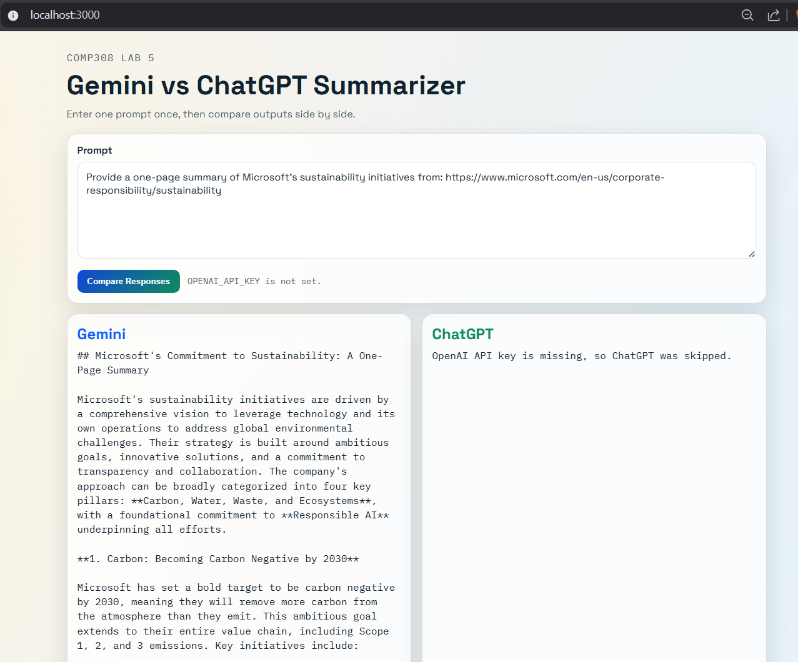

# Gemini vs ChatGPT Summarizer (Lab 5)

A Node.js app that compares responses from Google Gemini and OpenAI ChatGPT for the same prompt.

It includes:
- A web UI for side-by-side comparison
- A CLI example for direct Gemini usage

## Screenshot



## Project Structure

- `server.js`: Express server and API routes
- `public/`: Frontend files (`index.html`, `app.js`, `styles.css`)
- `gemini-example.js`: Standalone Gemini CLI sample
- `.env.example`: Environment variable template

## Prerequisites

- Node.js 18+
- npm
- API keys:
  - Gemini API key
  - OpenAI API key

## Setup

1. Install dependencies:

```bash
npm install
```

2. Create your env file from the template:

```bash
copy .env.example .env
```

3. Open `.env` and add your API keys:

```env
GEMINI_API_KEY=your_gemini_key_here
OPENAI_API_KEY=your_openai_key_here

# Optional overrides
GEMINI_MODEL=gemini-2.5-flash-lite
OPENAI_MODEL=gpt-4.1-mini
PORT=3000
```

## Run the Web App

```bash
npm start
```

Then open:

- http://localhost:3000

## Run the CLI Example

```bash
npm run cli
```

This runs `gemini-example.js`, which sends a sample sustainability-summary prompt to Gemini and prints the result in the terminal.

## API Endpoints

### Health Check

`GET /api/health`

Returns whether required API keys are present:

```json
{
  "ok": true,
  "missing": []
}
```

### Compare Prompt

`POST /api/compare`

Request body:

```json
{
  "prompt": "Summarize ..."
}
```

Sample response:

```json
{
  "prompt": "Summarize ...",
  "gemini": "...",
  "chatgpt": "...",
  "warnings": []
}
```

## NPM Scripts

- `npm start`: Start Express web server
- `npm run cli`: Run Gemini CLI sample
- `npm test`: Placeholder (`No tests configured`)

## Troubleshooting

- If either model output is skipped, verify its API key in `.env`.
- Check key status quickly with `GET /api/health`.
- If port `3000` is busy, set `PORT` in `.env` to a free port.

## Notes

- The frontend submits one prompt to both models and displays results side by side.
- Model names can be changed using `GEMINI_MODEL` and `OPENAI_MODEL` in `.env`.
